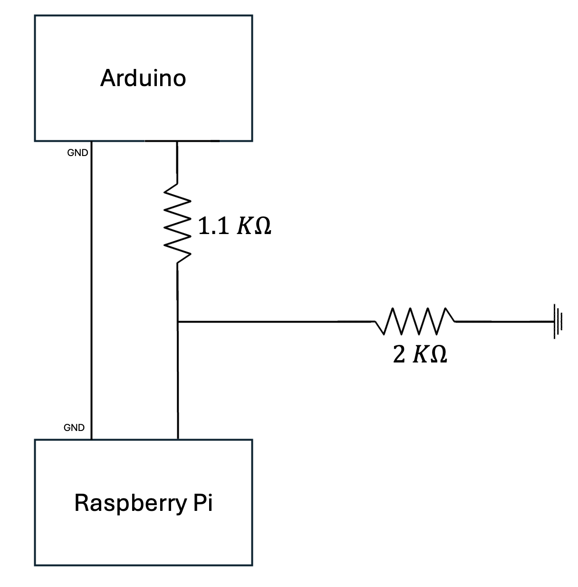

# High-Speed Camera System
An embedded system for visualizing fast UV-triggered polymerization reactions in slow motion.

## Table of Contents
- [High-Speed Camera System](#high-speed-camera-system)
  - [Introduction](#introduction)
  - [System Architecture](#system-architecture)
  - [System Components](#system-components)
  - [Optimizing Capture Speed](#optimizing-capture-speed)
  - [Frame Processing and Output](#frame-processing-and-output)
  - [System Testing Update](#system-testing-update)
  - [Outdoor Lighting Test](#outdoor-lighting-test)
    - [Sample Captures](#sample-captures)
  - [Exhibit Testing – First On-Site Capture Attempts](#exhibit-testing--first-on-site-capture-attempts)
  - [Mouse Based Triggering of Video Capture](#mouse-based-triggering-of-video-capture)
  - [Prototype Assembly and Function](#prototype-assembly-and-function)
  - [Hardware Integration](#hardware-integration)
  - [Next Steps](#next-steps)
 

## Introduction

Fast polymerization reactions triggered by UV light occur too quickly to be captured by the human eye or standard cameras.

We present a low-cost embedded system that detects the UV flash and records the reaction using high-speed imaging, enabling slow-motion playback for detailed observation and live demonstration.
## System Architecture

1. A UV flash occurs, triggering a fast polymerization reaction.
2. An analog UV sensor detects the flash.
3. The signal is digitized by an external ADC and read by a Raspberry Pi 3.
4. Upon detection, the Raspberry Pi captures a high-speed burst of frames using the Raspberry Pi Camera Module v2.
5. Frames are buffered in RAM for fast access.
6. Playback is displayed on an HDMI screen and controlled via physical buttons (Play / Pause / Reset).
## System Components

- **Raspberry Pi 5** – Responsible for capturing images and displaying playback.
- **Raspberry Pi Camera Module v2** – Used to record high-speed frames of the reaction.
- **GUVA-S12SD UV Sensor** – Detects the presence of UV light to signal the start of recording.
- **External ADC** – Converts the analog signal from the UV sensor to a digital format.
- **HDMI Display** – Displays the slow-motion playback of the recorded footage.
- **Physical Buttons (Play / Pause / Reset)** – Used for user interaction with playback.
  
## Optimizing Capture Speed

To successfully capture the fast polymerization reaction, the system must record a short, intense event that completes in under 100 milliseconds. Standard camera configurations are inadequate for such timing, so we needed to significantly increase the camera’s frame rate.

The Raspberry Pi Camera Module v2 uses a **rolling shutter**, meaning it reads each frame line by line (row by row) from top to bottom, rather than capturing the entire image at once. As a result, the time it takes to capture a full frame is directly proportional to the number of rows. By reducing the **vertical resolution** (height) of the image, the camera completes each frame readout more quickly allowing for much higher frame rates.

In our configuration, we reduced the image height to only 64 rows using the `-h 64` flag. This trade-off results in a narrow horizontal viewing band, but enables the camera to reach approximately 975 frames per second when combined with increased analog gain and optimized sensor parameters. Reducing the **width** of the image, on the other hand, has negligible impact on performance, since each row is still read as a unit. Therefore, vertical reduction is the most effective method for achieving high-speed capture with this sensor.

The resulting frames were buffered in RAM to ensure minimal write delays, and later processed into a slow-motion video using precise timing information for synchronization.

---

## Frame Processing and Output

We used the open-source `raspiraw` tool to capture raw Bayer-format frames directly from the Raspberry Pi Camera Module v2. Captured frames were converted to `.tiff` format using `dcraw`, and then compiled into a synchronized slow-motion video using `ffmpeg`, referencing the original timestamps.

This pipeline allowed us to reconstruct the short, high-speed event into a temporally stretched video that reveals details not visible at normal playback speeds.

Currently, the recorded frames appear dark due to limited lighting during initial testing. We are experimenting with improved lighting conditions, but expect that the final exhibit setup, which includes a strong UV flash during the reaction, will provide sufficient illumination without the need for supplemental light sources. If needed, we have the option to integrate additional lighting into the exhibit to ensure consistent visibility and recording quality.

---

## System Testing Update

To evaluate the high-speed capture pipeline before testing the actual polymerization reaction, we conducted a preliminary run using a simple scene: a rotating fan under dim indoor lighting.

**[View sample capture](https://drive.google.com/file/d/1PzW4zkaScqAXy1D3jOnbjnEaSPEWVI3p/view)**

This recording confirms that the system can detect and respond to visual motion and brief light changes, even under minimal illumination. Although the frames appear dark, the capture timing and buffering logic performed as expected.

---

## Outdoor Lighting Test

To verify that the camera performs well under stronger lighting conditions, we conducted an outdoor test using daylight and a stream of water as the subject. The goal was to ensure that the system reliably captures fast motion when sufficient illumination is available.

This test reused the same optimized capture configuration, with a vertical resolution of 64 rows and a frame rate of approximately 975 fps. Due to the limited frame height, the visible portion of the scene is reduced to a narrow horizontal band, requiring careful alignment of the subject within this region. In this case, the camera was sometimes rotated or inverted to better align the subject vertically within the reduced frame.

### Sample Captures

1. **[Sample 1 – Stream falling vertically](https://drive.google.com/file/d/1tkDQBM2TiiqNo0x5NmPXNWECEWIrQ5F-/view)**  
   The water stream is clearly visible as droplets fall, although the image appears upside down due to the camera being physically inverted. Despite this, the capture demonstrates that the system successfully records fast vertical motion within the limited frame height.

2. **[Sample 2 – Droplets hitting the ground](https://drive.google.com/file/d/1HDNrdlW91r2VxZYlnDlstKxNU1lgPaSQ/view)**  
   After correcting the camera orientation, the main water stream was missed due to imperfect horizontal alignment within the reduced frame height. However, droplets that rebounded off the ground were still captured, demonstrating motion detection near the frame edges.

3. **[Sample 3 – Less successful attempt](https://drive.google.com/file/d/1XEx5hrPEJuywzcE6ZUDVG6fwlSdQVgLJ/view)**  
   This capture was less successful, but still verifies the system’s ability to detect and record motion. At this stage, we chose not to further fine-tune alignment, as the results were sufficient to validate the functionality ahead of exhibit-specific testing.

---

## Exhibit Testing – First On-Site Capture Attempts

After validating the system under outdoor conditions, we conducted the first test on the actual exhibit. The goals of this session were to evaluate whether the built-in UV flash provides sufficient illumination, determine an initial camera position that captures the polymerization droplet clearly, and select a frame rate that balances motion resolution and recording duration.

**Preliminary attempt – Width 480 (failed)**  
We initially attempted to capture at width 480 and height 64 for 2 seconds at 660 fps  
The system returned a memory overflow error, likely due to buffer limitations at this width and frame rate combination  
No video was recorded  

**Attempt 1 – 'first_angle' [video link](https://drive.google.com/file/d/1XnBNxm8tU3VQpRA91qte8zRlW4S25yey/view?usp=sharing)**  
Camera placed behind the exhibit at very short distance  
Height 64, width 320, 660 fps, duration 1.5 seconds  
Result: extreme overexposure due to UV flash  
Saturation begins around 0.05 seconds and persists for ~5 seconds, obscuring the droplet completely  

**Attempt 2 – 'second_angle' [video link](https://drive.google.com/file/d/1Hyd2K05YBTS2U5h5Ollt0MIzkuETlodg/view?usp=drive_link)**  
Camera repositioned to doorway, approximately 0.5 meters from the exhibit  
Same resolution and duration as above  
The UV flash still causes significant overexposure around 0.20 seconds  
Droplet motion is not clearly visible  

**Attempt 3 – 'position_cam' [video link](https://drive.google.com/file/d/1Hyd2K05YBTS2U5h5Ollt0MIzkuETlodg/view?usp=drive_link)**  
Switched to 90 fps to help determine spatial framing  
The droplet is partially visible and suggests the need to shift the camera slightly to the left and downward  

**Attempt 4 – 'position_cam_2ndTry' [video link](https://drive.google.com/file/d/1h7z4Tb6kj34zj2ObndDjuNtJaOW4lgTu/view?usp=drive_link)**  
Adjustment made based on previous framing  
Droplet visibility improved, but further refinement is needed  

**Attempt 5 – 'position_cam_3rdTry' [video link](https://drive.google.com/file/d/1QLZG5moAc6I2PqqHCZD2S2QvedE6nByG/view?usp=drive_link)**  
Minor additional adjustments  
Closer to correct framing but still slightly misaligned  

**'heigh-64--fps-660' [video link](https://drive.google.com/file/d/1kSxTVTmyV0xH4dVVgWqpBf7O7T3rRGqm/view?usp=drive_link)**  
Camera placement appears to be close to optimal  
Droplet is more consistently visible and the UV flash no longer overwhelms the image  
This test served as a reference point for further adjustments 

**Final test of the day – 'high-fps-final' [video link](https://drive.google.com/file/d/1PDiuaL70WirRHc-hoIIKpiJEuty05d2K/view?usp=drive_link)**  
Same camera position as in the 660 fps test, but captured at 1000 fps to improve temporal resolution  
Motion appears significantly smoother, with the droplet becoming visible around 0.07 seconds  
Compared to the 660 fps version, this recording shows less choppiness and better continuity of motion.

---

## **Mouse Based Triggering of Video Capture**

After validating the high-speed capture pipeline and obtaining promising initial results, we added functionality to trigger the recording process via a mouse click. This change streamlines operation and makes the system more suitable for interactive use during testing and future exhibit deployment.

To implement this, we connected a USB mouse to the Raspberry Pi 3 and installed the necessary dependencies using apt, including evtest, python3-evdev, and ffmpeg. We then used the ls /dev/input/by-id/ command to identify the device name associated with the mouse, and confirmed the specific event path was event1. We verified this using the evtest command, which displayed real-time input events. For example, when pressing the right mouse button, we observed:

Event: time 1753012817.775234, type 4 (EV_MSC), code 4 (MSC_SCAN), value 9000  
Event: time 1753012817.775234, type 1 (EV_KEY), code 273 (BTN_RIGHT), value 1  
Event: time 1753012817.775234, type 0 (EV_SYN), code 0 (SYN_REPORT), value 0  

Based on this, we wrote a Python script named mouse_trigger.py that listens for right or middle click events and launches the video capture pipeline accordingly. We made the script executable using chmod +x mouse_trigger.py, tested it with sudo ./mouse_trigger.py, and verified that it successfully triggers the recording process when the mouse is clicked. While we intend to eventually configure the script to run automatically on boot using systemd, we have postponed this step for now in order to focus on other development priorities. The script is included in the scripts/ directory of this repository.

---

## Prototype Assembly and Function

At this stage of the project, our objective is to make the exhibit prototype fully operational so that we can integrate our high speed camera system onto it for testing and further development. Using the prototype allows us to perform controlled experiments, evaluate camera performance under realistic operating conditions, and refine both hardware and software before integrating the finalized camera into the actual museum exhibit.

The following images, taken from the museum’s official documentation, show the main components of the exhibit prototype and illustrate its operating sequence.

When the exhibit is activated, a droplet of photopolymer material is released from the liquid container by the stepper motor and peristaltic pump mechanism. As the droplet passes through the optical sensor, the sensor detects it and immediately triggers the UV curing lights. When the droplet enters the illuminated area, the polymerization process begins, solidifying the droplet in real time.

*Upper section, Liquid container and droplet dispensing mechanism*  
  

*Central section, Optical sensor, UV LED curing module, and stepper motor mechanism*  
  

*Bottom section of the exhibit, Collection base and guiding elements*  
  

The system consists of four main subsystems, described below in the logical order of operation:

1. **Stepper Motor and Peristaltic Pump**
   
   The droplet dispensing mechanism is powered by a bipolar stepper motor coupled to a peristaltic pump. This setup ensures precise droplet volume control and consistent release intervals, both of which are essential for accurate triggering and curing.  

   The stepper motor is driven by a dedicated driver controlled by the shield, allowing firmware based adjustments to speed and timing. Mechanical alignment of the nozzle relative to the detection beam is critical, even small deviations can affect detection accuracy.

2. **Drop Detection System**  
    
   Once the droplet is released, it passes through a custom built optical sensor designed and assembled in house at the museum. Based on the provided schematic, it uses a dedicated light source and photodetector arranged so that a passing droplet partially blocks or scatters the beam. This causes a measurable change in sensor output, processed by conditioning electronics to filter noise, stabilize the signal, and generate a clean digital trigger.  

   The detection module is implemented on a compact, project specific PCB that includes the photodetector, connectors, and all required passive components for stable and repeatable operation. It interfaces directly with the control shield for real time triggering of the curing light.  

   *Schematic, Drop Sensor*  
     

   *PCB Layout, Drop Sensor*  
     

3. **Control and Integration Shield**  
    
   Acting as the central hub, the custom control shield mounted on an Arduino based microcontroller manages all electrical connections, signal routing, and power distribution.  

   It receives the trigger from the detection system, sends activation signals to the UV curing light, and controls the stepper motor driver for droplet dispensing. During testing, it also allows flexible reconfiguration of timing parameters and operational modes.  

   *Schematic, Control Shield*  
     

   *PCB Layout, Control Shield*  
     

   Electronic dashboard of the control systemת This panel contains all the necessary connections for the stepper motor, UV LEDs, sensor, and control buttons, as well as potentiometers for setting drop number, drop rate, and curing time. The OLED display provides real time status information, enabling quick configuration during tests.  
     

4. **UV Curing Light System**  
    
   Triggered by the control shield, the UV curing subsystem consists of a custom high power UV LED module, also designed and assembled in house. The LED array is driven by a dedicated circuit that provides stable current and precise timing control.  

   The curing wavelength is matched to the photopolymer’s requirements to ensure rapid solidification. Pulse duration is tightly controlled, too short results in incomplete curing, while too long could negatively affect visual quality.  

   *Schematic, UV Curing Light*  
     

   *PCB Layout, UV Curing Light*  
     

## **Hardware Integration**

Before we could begin developing our control logic for the exhibit’s prototype, we first needed to familiarize ourselves with working on the Arduino platform. After several unsuccessful attempts to upload our first test sketch, we discovered that the issue was not with the code itself, but with the configuration in the Arduino IDE. The Board, Processor, and Port settings had to match our actual hardware in order for uploads to succeed. Once we selected:

Board: Arduino Nano

Processor: ATmega328P

Port: /dev/cu.usbserial-10

compilation and uploading worked perfectly, allowing us to proceed.

Our first task was to run a basic LED blink test to confirm that our environment was set up correctly and that we could upload and execute code. The test simply turned the onboard LED on for one second, then off for one second, while printing the LED state to the Serial Monitor.

Once uploaded, the onboard LED began blinking at one-second intervals, and the Serial Monitor displayed alternating “LED ON” and “LED OFF” messages, confirming full communication between the IDE and the microcontroller.

  

Once compiled and uploaded, the board responded exactly as intended—the LED pulsed at one-second intervals, and the Serial Monitor displayed the corresponding messages. This confirmed that our development environment was correctly configured and that we could reliably program and communicate with the microcontroller.

With the basics in place, we moved on to the prototype hardware. We took the custom PCB designed for the exhibit and began learning soldering techniques so that we could mount the Arduino, the stepper motor driver, and the necessary connectors for both the optical drop sensor and the stepper motor. After the components were soldered and visually inspected for proper joints and alignment, we connected the key wires according to the schematic. At this stage, we decided not to connect the UV LED array we leave that part of the system offline until later in the integration process.

In the original version of the exhibit’s code, operation relied on physical controls: a start push button connected to pin D3 and three potentiometers used to set the number of drops, the interval between drops, and the long cycle timing. While these controls are suitable for a final museum installation, they were not convenient for our development workflow. Adjusting hardware knobs and pressing buttons on the exhibit each time we needed to change parameters or start a test would have slowed down our iteration process. We also wanted the ability to log and adjust settings directly from the development machine while monitoring the system’s state in real time.

To address this, we modified the final exhibit code to replace the physical interface with a serial command interface. We implemented a simple text based protocol in which typing go into the Serial Monitor sets an internal active flag and starts the motor routine to dispense drops:

if (command == "go") {  
    active_flag = true;  
    move_motor(true);  
}

Typing stop halts all motion and processes:

if (command == "stop") {  
    active_flag = false;  
    move_motor(false);  
}

Additional commands such as help display the available commands, and status prints the current system state, including drop count, active status, and sensor readings. We also introduced a family of set commands to replace the potentiometers, allowing us to directly assign parameters like the number of drops per run, the time between drops, suspension and exposure times, and stepper speed. For example:

set drnum 15  // sets drops per run to 15  
set drprt 3   // sets seconds between drops to 3  

These parameters are stored in variables already defined in the project’s header files, making them immediately usable by the existing control logic.

This serial based control method proved invaluable for prototype testing. It enabled us to quickly iterate on settings without touching the hardware, maintain precise control over the sequence of events, and focus entirely on verifying motor motion, drop detection, and system responsiveness. With these modifications in place, we had a stable and flexible foundation for integrating the high speed camera, confident that we could trigger and monitor the drop process entirely from the development environment.

After finalizing the updated code and successfully uploading it to the Arduino, we were ready to test the prototype in real conditions. When we first powered the system, a few drops of photopolymer material fell through the nozzle, leftovers that had been sitting in the tubing for nearly two years. Once that residual material was depleted, the chemical reaction that normally hardens the drops was no longer relevant for our current stage, since our focus at this point was on the camera integration rather than the curing process. To keep testing, we decided to replace the photopolymer with water.

After switching to water, the droplet dispensing mechanism stopped functioning entirely. Initially, we suspected an electrical issue and tested various components, but all were working as expected. We then turned to the software, modifying and testing the code, yet the problem persisted. The mechanism simply would not advance, leading us to suspect a mechanical fault or an unexpected interaction between the water and the system’s components.

Eventually, we decided that we needed to look inside the exhibit itself to get to the root of the problem. Disassembling the system revealed the true cause: a small amount of photopolymer residue had remained inside the nozzle and tubing. When we introduced water, the residual polymer reacted, triggering partial polymerization inside the narrow outlet path. Over time this reaction produced a hardened blockage that completely sealed the nozzle.

With the cause identified, the fix was straightforward. We replaced the liquid container, thoroughly cleaned the nozzle, and ensured that no hardened residue remained. Once reassembled, the system returned to normal operation, dispensing clean, consistent drops once again.

With the droplet mechanism restored, we turned our attention to the next milestone synchronizing the operation of the exhibit with the triggering of the high speed camera. We considered two possible approaches:

1. Connect to the exhibit’s start button, then apply a fixed delay (determined experimentally) before initiating camera capture.
2. Tap into the existing optical sensor, using its detection signal to trigger the camera precisely at the moment a droplet passes through.

After weighing the options, we chose the second method. It offered greater timing accuracy, ensured perfect alignment between droplet detection and camera recording, and required minimal additional hardware, as the sensor was already integrated into the exhibit’s control system.

Since the UV LEDs and OLED display were not yet connected, we had no visual confirmation that the optical drop sensor was functioning. To create a temporary diagnostic method, we modified the code so that specific pins would output a high signal whenever the sensor output went lowת which should occur when a droplet passes through and blocks the beam, pulling the sensor line to 0. In the original code, the sensor input pin was defined as:

#define SENSOR_IN (A0)

We kept the same input pin but added logic to mirror its state to another output pin for monitoring. This way, if the sensor detected a drop, the output pin could be probed or connected to an external LED for immediate feedback.

Initially, we tried reading and printing the sensor values directly to the Serial Monitor before wiring everything into the system, but no readings appeared. This led us to suspect that the sensor might be faulty. We knew from documentation that a functional sensor should illuminate its onboard LED when detecting an object, but in our case, no LED lit up. We wondered if the sensor simply couldn’t detect water, but even when we placed a finger in the beam, nothing happened.

Convinced the sensor might be defective, we removed it from the system and connected it to a benchtop power supply. When powered this way, passing a hand through the beam triggered the onboard LED. However, once reinstalled in the exhibit, it again failed to detect anything. Closer inspection revealed the root cause: the wiring in the exhibit had been reversed. The wire meant for ground was connected to the positive supply, and the positive lead was connected to ground. This wiring error effectively prevented the sensor from operating at all.

We disassembled the relevant section of the wiring, corrected the connections, and tested again. With the wiring fixed, the sensor reliably triggered when a hand passed through the beam. Unfortunately, when we powered on the exhibit and tested with water drops, it still did not detect them. Even after coloring the water to increase contrast, there was no detection. We then realized that the sensor’s detection zone was physically narrowת if the droplet didn’t pass exactly through this beam path, it wouldn’t register. After carefully adjusting the droplet’s alignment so it passed directly through the beam’s center, the sensor successfully triggered, confirming our suspicion and restoring its functionality.

With the sensor now operating correctly, our next objective was to connect the Arduino to the Raspberry Pi so the Pi could receive a trigger signal each time a drop was detected. This would allow the Pi to start high speed video capture in perfect synchronization with the event. On the PCB, the drop sensor’s output is labeled SENSE2, but for the Pi connection we selected the unused SENSE4 interface to avoid interfering with the existing exhibit circuitry. On the Arduino side, we used pin A3 which was wired to pin 2 of SENSE4, with pin 3 as ground and pin 1 (Vin) left unconnected.

Because the Arduino operates at 5-volt logic and the Raspberry Pi GPIO pins are limited to 3.3 V, we needed a safe way to reduce the voltage before sending it to the Pi. We built a passive voltage divider using resistors to bring the signal down to approximately 3.2 V

The schematic of the voltage divider is shown below:

We selected two standard resistor values: 1.1 kΩ for R₁ and 2 kΩ for R₂, forming a simple voltage divider, which yields the following output voltage:

This voltage is within the safe input range for the Raspberry Pi GPIO and is well above the minimum voltage required to register a logical HIGH.
According to the BCM2835 datasheet and technical documentation, the threshold for detecting a HIGH input is:

Thus, a signal of approximately 3.22 V provides a safety margin of over 0.9 V above the threshold, ensuring reliable logic level detection.

The divider was made from three 1 kΩ resistors, with two of them connected in series to form the equivalent of a 2 kΩ resistor. We assembled the circuit with jumper wires and heat-shrink tubing for strain relief, then connected it between the Arduino’s A3 output and the Pi’s GPIO input.

Before connecting to the Pi, we verified the voltage output using a multimeter. The reading confirmed that the divider consistently produced about 3.2 V from a 5 V input, ensuring we could interface with the Pi without risk of damage. Our first attempts to solder the resistor connections led to an unexpected problem: after soldering, the multimeter measured 0 V at the output. Rather than spend excessive time diagnosing the cause, we decided to abandon soldering for this part and instead rely on solid mechanical connections with jumper wires, which immediately restored the correct voltage reading. With this in place, the Arduino could now output a clean, safe trigger signal to the Raspberry Pi whenever the sensor detected a droplet.

## Next Steps

??

